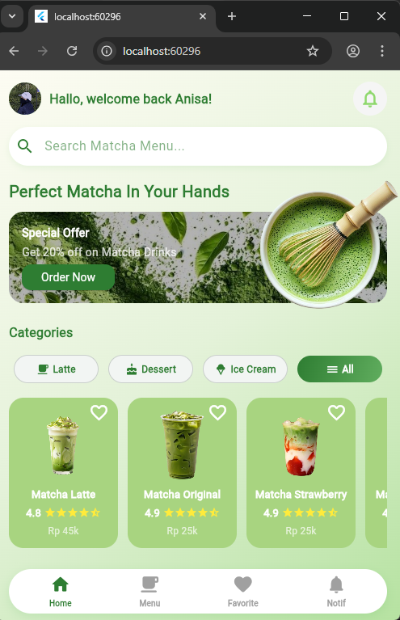
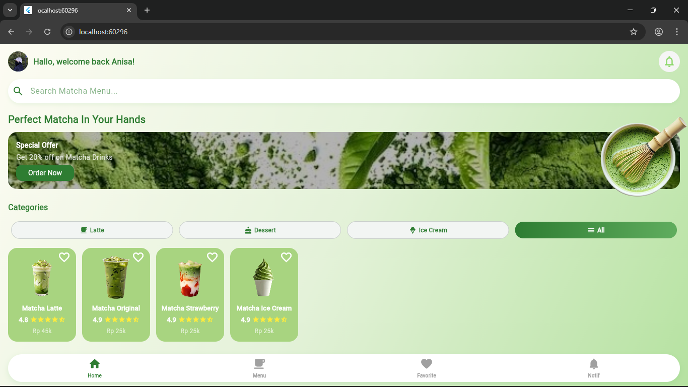

# MatchaMood — Aplikasi Menu Matcha Berbasis Flutter

MatchUrr adalah aplikasi mobile berbasis Flutter yang dirancang untuk menampilkan daftar menu minuman dan makanan berbahan dasar matcha. Aplikasi ini menghadirkan antarmuka modern, interaktif, serta responsif, dengan pengalaman pengguna yang sederhana dan mudah digunakan.

---
Anggota Kelompok :
- Anisa Tri Zaskia (232101077)
- Delia Andreyani (232101060)
- SifaMia Juniarti (232101076)
---

## 1. Fitur Utama
- **Profil & Sapaan Pengguna**  
  Menampilkan foto pengguna dan ucapan selamat datang.

- **Pencarian Menu**  
  Search bar untuk mencari item secara cepat.

- **Kategori Menu**  
  Filter: Latte, Dessert, Ice Cream, All.

- **Menu Card Animasi**  
  Gambar produk bergerak halus menggunakan `AnimationController`.

- **Icon Favorite**  
  Pengguna dapat menandai produk.

- **Bottom Navigation**  
  Navigasi sederhana: Home, Menu, Favorite, Notif.

  

---

## 2. Screenshot Aplikasi

**Contoh tampilan aplikasi:**  
  

---

## 3. Dokumentasi Laporan
Dokumentasi lengkap dalam bentuk PDF dan ScreenRecord dapat diakses pada tautan berikut:

📄 **Google Drive:**  
https://drive.google.com/drive/folders/1dRC2NMT1aq1IKJEzJ97vri9rM_-oeD18?usp=sharing

---

## 4. Teknologi yang Digunakan
- Flutter 3.x  
- Dart  
- Riverpod (state management)  
- Material UI + Custom Animations  

